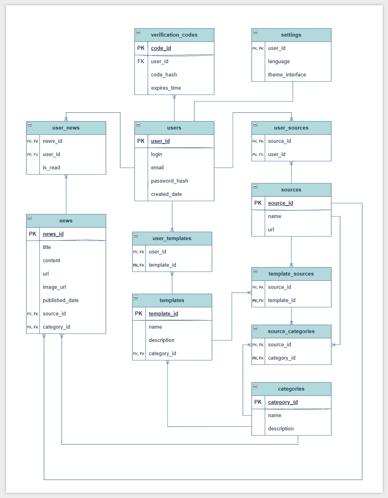

# Агрегатор новостного контента пользователя

курсовая работа по предмету Информационные Системы 😊

## этап 1. идея и требования к разработке продукта 

## <span style="color:#C3A9FD"> Software Requirements Specification</span>

## <span style="color:#C3A9FD"> 1. Introduction (Введение)</span>

### <span style="color:#C3A9FD">1.1 Purpose</span>

Данный документ является спецификацией к разработке продукта "Агрегатор новостного контента пользователя". Содержит функциональные и нефункциональные требования, накладывающие определенные ограничения на разработку.

### <span style="color:#C3A9FD">1.2 Scope (Область применения)</span>

Агрегатор новостного контента пользователя - интернет-ресурс, позволяющий организовать и агрегировать поток новостей, отслеживаемый пользователем в одном месте.

Далее в документе название может быть сокращено до "Агрегатор".

* Целевая аудитория: Продукт предназначен для лиц, заинтересованных в обстановке в мире, отслеживающих множество новостных ресурсов;

* Основные функции ресурса:
    * Агрегирование пользовательского контента по категориям (например, новости IT, спорта, фондового рынке) в одном месте;
    * Автоматический мониторинг источников и актуальное обновление главной страницы с новостями;

* Границы системы:
    * Пользователи могут пополнять список отслеживаемых ресурсов из списка предлагаемых "Агрегатором";
    * Пользователи могут удалять ресурсы из списка отслеживаемых;
    * Пользователи могут просматривать сводки новостей на главной странице и при нажатии на определенную новость изучать полное содержимое;
    * Пользователи могут переходить на оригинальный источник новости;
    * Пользователи не могут добавлять собственные источники новостей;
    * Пользователь не может просматривать и редактировать страницу новостей другого пользователя.

## <span style="color:#C3A9FD"> 2. Functionality (Функциональные требования)</span>

### <span style="color:#C3A9FD"> 2.1 Авторизация</span>

F2.1.1 Система должна предоставлять пользователю возможность зарегистрироваться с помощью уникального логина, адреса электронной почты и пароля;

F2.1.2 Система должна предоставлять пользователю возможность войти в уже существующий аккаунт при помощи логина и пароля;

F2.1.3 Система должна предоставлять пользователю возможность восстановить пароль с помощью отправки проверочного кода на почту;

F2.1.4 Система должна отслеживать время "жизни" проверочного кода, отправляемого на почту и в случае попытки ввести уже просроченный код выдавать ошибку.

### <span style="color:#C3A9FD"> 2.2. Изменение списка отслеживаемых источников</span>

F2.2.1. Система должна предоставлять пользователю возможность просмотра доступных для отслеживания источников;

F2.2.2 Система должна предоставлять пользователю возможность добавления источника в список отслеживаемых;

F2.2.3 Система должна предоставлять пользователю возможность удалять источник из списка отслеживаемых;

F2.2.4 Система должна предоставлять возможность добавления шаблона - набор новостных источников в одной тематике (финансы, спорт, IT и тд).

### <span style="color:#C3A9FD"> 2.3 Главная страница - агрегация по категориям</span>

F2.3.1 Система должна самостоятельно классифицировать новости по категориям;

F2.3.2 Система должна агрегировать новости одной тематики в группу и отображать их в виде стопки бумаг, где последняя бумага - последняя новость в данной группе;

F2.3.3 Система должна предоставлять пользователю возможность при нажатии на категорию просматривать все новости, содержащиеся в ней;

F2.3.4 Система должна автоматически мониторить публикацию актуальных новостей отслеживаемых источников и обновлять главную страницу.

## <span style="color:#C3A9FD"> 3. Usability (Требования к удобству использования)</span>

U3.1 Система должна удовлетворять [10 эвристикам Нильсона](https://www.nngroup.com/articles/ten-usability-heuristics/);

U3.2 Основные функции системы должны быть доступны в не более чем 2 клика;

U3.3 Система должна предоставлять поддерживать различные темы интерфейса: светлую и темную

### <span style="color:#C3A9FD"> 3.2 Прецеденты использования</span>

#### <span style="color:#C3A9FD">3.2.1 Прецедент: добавление источника новостей</span>

| Параметр | Значение |
| :---- | :---- |
| **ID** | 1 |
| **краткое описание** | авторизованный пользователь добавляет новостной ресурс в список отслеживаемых |
| **главный актер** | авторизованный пользователь |
| **предусловия** | пользователь авторизован в системе пользователь находится на главной странице приложения |
| **основной поток** | пользователь нажимает на кнопку "изменить список источников" пользователь видит список доступных для отслеживания источников пользователь выбирает один из них и нажимает на него  |
| **альтернативный поток** | если соединение разорвано - система пытается восстановить его если источник перестал быть возможным к отслеживанию, он больше не отображается в списке |
| **постусловия** | добавленный источник отслеживается системой и его актуальные новости добавляются в пользовательские категории |

#### <span style="color:#C3A9FD"> 3.2.2 Прецедент: просмотр всех новостей одной тематики</span>

| Параметр | Значение |
| :---- | :---- |
| **ID** | 2 |
| **краткое описание** | авторизованный пользователь просматривает все новости в одной группе (теме) |
| **главный актер** | авторизованный пользователь |
| **предусловия** | пользователь авторизован в системе пользователь находится на главной странице приложения пользователь уже имеет список отслеживаемых источников новости отображаются по группам в виде стопок бумаг на главной странице приложения |
| **основной поток** | пользователь нажимает на группу новостей  все новости в данной группе отображаются в виде вертикальной ленты скроллинга пользователь просматривает их и при необходимости переходит на оригинальный сайт новости  |
| **альтернативный поток** | если соединение разорвано - система пытается восстановить его если появилась новая новость в данной категории, она отображается в потоке |
| **постусловия** | пользователь в случае перехода на оригинальный источник изучает новость на внешнем сайте |

#### <span style="color:#C3A9FD"> 3.2.3 Прецедент: восстановление забытого пароля пользователя</span>

| Параметр | Значение |
| :---- | :---- |
| **ID** | 3 |
| **краткое описание** | пользователь, имеющий аккаунт в системе при авторизации забывает пароль и нажимает на кнопку "Забыли пароль?" и система отправляет проверочный код на почту |
| **главный актер** | пользователь, имеющий аккаунт в системе |
| **предусловия** | пользователь ранее заводил аккаунт в системе, указав свою почту, логин и пароль в окне регистрации на данный момент он забыл свой пароль( пользователь находится на окне авторизации |
| **основной поток** | пользователь нажимает на кнопку "Забыли пароль?" система отправляет проверочный код (с фиксированным временем жизни) на почту, указанную в аккаунте пользователя и уведомляет пользователя, что проверочный код отправлен пользователю приходит проверочный код на почту он вводит его в окно ввода проверочного кода код корректен и система предлагает пользователю сменить пароль пользователь вводит новый пароль и авторизуется |
| **альтернативный поток** | если пользователь не имеет доступ к указанной в аккаунте почте, он не сможет восстановить доступ к аккаунту если пользователь пытается ввести простроченный код, система его не принимает |
| **постусловия** | пользователь авторизован в системе и находится на главной странице приложения |

### <span style="color:#C3A9FD"> 3.3 Design Constraints (Ограничения разработки)</span>

3.3.1 В качестве архитектуры системы выбрать микросервисную;

3.3.2 Для разработки бэкенда использовать язык программирования Kotlin и фреймворк Spring Boot с необходимыми модулями;

3.3.3 В качестве брокера сообщений (для обмена сообщениями основной сервис и сервис отправки емейлов) использовать Kafka;

3.3.4 В качестве системы сборки использовать Gradle;

3.3.5 Разработку вести по методологии Agile;

3.3.6 Для разработки фронтенда использовать язык программирования JavaScript с библиотекой React.js;

3.3.7 Для взаимодействия фронтэнда и бэкенда использовать протокол HTTP, спецификацию REST;

3.3.8 Для хранения данных использовать базу данных PostgreSQL.

<span style="color:#C3A9FD"> 3.3.9 Планируемая архитектура приложения:</span>


#### <span style="color:#C3A9FD"> 3.4 User Interfaces (Пользовательские интерфейсы)</span>

*Основная палитра:*

*<span style="color:#C3A9FD; font-size:20px"> C3A9FD </span>*
*<span style="color:#D9D9D9; font-size:20px"> D9D9D9 </span>*
*<span style="color:#F5F5F5; font-size:20px"> F5F5F5 </span>*

*Основной шрифт:*

* <span style="font-family: Jaini,serif; font-size: 20px"> Jaro</span>
* <span style="font-family: JetBrains Mono,sans-serif; font-size: 20px "> JejuMyeongjo</span>


### <span style="color:#C3A9FD"> 3.5 Software Interfaces (Программные интерфейсы)</span>

3.5.1 API для интеграции с почтой:

* Встроенная интеграция Spring с javax.mail API - JavaMailSender

3.5.2 API для оперативной информации:

* Яндекс.Погода API: [https://yandex.ru/dev/weather/](https://yandex.ru/dev/weather/),
* API курсов валют ЦБ РФ: [https://www.cbr.ru/development/SXML](https://www.cbr.ru/development/SXML/)

### <span style="color:#C3A9FD"> 3.6 Licensing Requirements (Требования к лицензированию)</span>

3.6.1 Лицензия на контент

* Контент сайта защищён авторскими правами, использование контента возможно только с разрешения правообладателя.

3.6.2 Лицензия на сторонние библиотеки или API

* Сайт обязуется соблюдать лицензионные условия сторонних сервисов.

3.6.3 Лицензия на медиа

* Сайт обязуется иметь и соблюдать лицензионное соглашение на не принадлежащие ему медиа, используемые на сайте.

## этап 2. проектирование базы данных

## <span style="color:#C3A9FD">er-модель базы данных</span> 


## <span style="color:#C3A9FD">даталогическая модель базы данных</span>


## <span style="color:#C3A9FD">SQL скрипты</span>

### <span style="color:#C3A9FD">создание БД и таблиц</span> 

```sql
SELECT 'CREATE DATABASE news_aggregator' WHERE NOT EXISTS (
    SELECT FROM pg_database WHERE datname = 'news_aggregator'
)

-- Установить контекст для созданной БД
\c news_aggregator

CREATE TABLE categories (
    category_id SERIAL PRIMARY KEY,
    name VARCHAR(100) NOT NULL UNIQUE,
    description TEXT
);

CREATE TABLE users (
    user_id SERIAL PRIMARY KEY,
    login VARCHAR(50) NOT NULL UNIQUE,
    email VARCHAR(100) NOT NULL UNIQUE CHECK (
        email ~* '^[A-Za-z0-9._%+-]+@[A-Za-z0-9.-]+\.[A-Za-z]{2,4}$'
    ),
    password_hash CHAR(60) NOT NULL, -- Хэш пароля
    created_date TIMESTAMP WITHOUT TIME ZONE NOT NULL DEFAULT CURRENT_TIMESTAMP
);

CREATE TABLE verification_codes (
    code_id SERIAL PRIMARY KEY,
    user_id INTEGER NOT NULL REFERENCES users(user_id) ON DELETE CASCADE,
    code_hash VARCHAR(255) NOT NULL,
    expires_time TIMESTAMP WITHOUT TIME ZONE NOT NULL,
    -- Ограничение: один активный код на пользователя
    UNIQUE (user_id)
);

CREATE TABLE sources (
    source_id SERIAL PRIMARY KEY,
    name VARCHAR(255) NOT NULL UNIQUE,
    url VARCHAR(500) NOT NULL UNIQUE
);

CREATE TABLE source_categories (
    source_id INTEGER NOT NULL REFERENCES sources(source_id) ON DELETE CASCADE,
    category_id INTEGER NOT NULL REFERENCES categories(category_id) ON DELETE CASCADE,
    PRIMARY KEY (source_id, category_id)
);

CREATE TABLE templates (
    template_id SERIAL PRIMARY KEY,
    name VARCHAR(100) NOT NULL UNIQUE,
    description TEXT,
    category_id INTEGER REFERENCES categories(category_id) ON DELETE SET NULL
);

CREATE TABLE template_sources (
    template_id INTEGER NOT NULL REFERENCES templates(template_id) ON DELETE CASCADE,
    source_id INTEGER NOT NULL REFERENCES sources(source_id) ON DELETE CASCADE,
    PRIMARY KEY (template_id, source_id)
);

CREATE TABLE user_templates (
    user_id INTEGER NOT NULL REFERENCES users(user_id) ON DELETE CASCADE,
    template_id INTEGER NOT NULL REFERENCES templates(template_id) ON DELETE CASCADE,
    PRIMARY KEY (user_id, template_id)
);

CREATE TABLE user_sources (
    user_id INTEGER NOT NULL REFERENCES users(user_id) ON DELETE CASCADE,
    source_id INTEGER NOT NULL REFERENCES sources(source_id) ON DELETE CASCADE,
    PRIMARY KEY (user_id, source_id)
);

CREATE TABLE news (
    news_id SERIAL PRIMARY KEY,
    title VARCHAR(500) NOT NULL,
    content TEXT NOT NULL,
    url VARCHAR(500) UNIQUE NOT NULL, -- Ссылка на оригинал
    image_url VARCHAR(500),
    published_date TIMESTAMP WITHOUT TIME ZONE NOT NULL,
    source_id INTEGER NOT NULL REFERENCES sources(source_id) ON DELETE RESTRICT,
    category_id INTEGER NOT NULL REFERENCES categories(category_id) ON DELETE RESTRICT
);

CREATE TABLE user_news (
    user_id INTEGER NOT NULL REFERENCES users(user_id) ON DELETE CASCADE,
    news_id INTEGER NOT NULL REFERENCES news(news_id) ON DELETE CASCADE,
    is_read BOOLEAN NOT NULL DEFAULT FALSE,
    PRIMARY KEY (user_id, news_id)
);
```

### <span style="color:#C3A9FD">наполнение БД тестовыми данными</span>
```sql
INSERT INTO categories (name, description) VALUES
('IT', 'Новости технологий, гаджетов и др.'),
('Спорт', 'Футбол, хоккей, баскетбол и др.'),
('Финансы', 'Фондовый рынок, валюты, экономика и др.'),
('Политика', 'Государственные, международные новости и др.');

-- Вставка данных в users (пароли для примера, в реальной системе нужен хэш)
INSERT INTO users (login, email, password_hash) VALUES
('ivanov', 'ivanov@example.com', '$2a$10$T8.uQGZ2i7P7D0Yy6Hl.fuiU1/nQ1Fq/x2tB/sR.B.zU2/H6'), -- Хэш
('petrov', 'petrov@example.com', '$2a$10$T8.uQGZ2i7P7D0Yy6Hl.fuiU1/nQ1Fq/x2tB/sR.B.zU2/H6');

-- Вставка данных в sources (Используем category_id из предыдущего шага)
INSERT INTO sources (source_id, name, url) VALUES
(1, 'TechToday', 'https://techtoday.com'),
(2, 'SportsWorld', 'https://sportsworld.com'),
(3, 'FinReport', 'https://finreport.ru');

-- Установка M:N: source_categories (TechToday относится и к IT, и к Финансам)
INSERT INTO source_categories (source_id, category_id) VALUES
(1, 1), -- TechToday -> IT
(1, 3); -- TechToday -> Финансы


INSERT INTO news (title, content, url, published_date, source_id, category_id) VALUES
('Новый чип установлен', 'Детали о новом процессоре...', 'https://techtoday.com/chip-2025', '2025-10-18 10:00:00', 1, 1),
('Футбол: Результаты матча', 'Счет 3:1 в пользу хозяев.', 'https://sportsworld.com/match-result', '2025-10-18 11:30:00', 2, 2),
('Биржа: Рост акций IT-сектора', 'Анализ роста после отчетов.', 'https://finreport.ru/it-stocks', '2025-10-18 12:45:00', 3, 3),
('IT: Прогноз на ИИ в 2026', 'Эксперты предсказывают...', 'https://techtoday.com/ai-forecast', '2025-10-18 14:00:00', 1, 1);

INSERT INTO user_sources (user_id, source_id) VALUES
(1, 1), -- Иванов подписан на TechToday
(1, 2), -- Иванов подписан на SportsWorld
(2, 3); -- Петров подписан на FinReport

INSERT INTO user_news (user_id, news_id, viewed_date, is_read) VALUES
(1, 1, '2025-10-18 15:00:00', TRUE), -- Иванов прочитал 1 новость
(1, 2, NULL, FALSE); -- Иванов еще не прочитал 2 новость

```

### <span style="color:#C3A9FD">удаление БД</span>
```sql
SELECT pg_terminate_backend(pg_stat_activity.pid)
FROM pg_stat_activity
WHERE pg_stat_activity.datname = 'news_aggregator' AND pid <> pg_backend_pid();
-- Удаление базы данных
DROP DATABASE IF EXISTS news_aggregator;
```


### <span style="color:#C3A9FD">PL/PSQL процедуры для выполнения критически важных запросов</span>
```sql
-- Процедура для подписки пользователя
CREATE OR REPLACE FUNCTION subscribe_user_to_source(
    p_user_id INTEGER,
    p_source_id INTEGER
)
RETURNS VOID AS $$
BEGIN
    -- 1. Проверка существования пользователя и источника
    IF NOT EXISTS (SELECT 1 FROM users WHERE user_id = p_user_id) THEN
        RAISE EXCEPTION 'Пользователь с ID % не найден.', p_user_id;
    END IF;

    IF NOT EXISTS (SELECT 1 FROM sources WHERE source_id = p_source_id) THEN
        RAISE EXCEPTION 'Источник с ID % не найден.', p_source_id;
    END IF;

    -- 2. Добавление подписки. ON CONFLICT DO NOTHING предотвратит ошибку
    -- при повторной подписке и обеспечит идемпотентность.
    INSERT INTO user_sources (user_id, source_id)
    VALUES (p_user_id, p_source_id)
    ON CONFLICT (user_id, source_id) DO NOTHING;
    -- Сохранение изменений
    COMMIT;
END;
$$ LANGUAGE plpgsql;


-- Функция для проверки кода восстановления и возврата ID пользователя
CREATE OR REPLACE FUNCTION verify_reset_code(
    p_email VARCHAR,
    p_code_hash VARCHAR -- Входящий хэш кода, присланного пользователю
)
RETURNS INTEGER AS $$
DECLARE
    v_user_id INTEGER;
BEGIN
    -- 1. Поиск пользователя по email
    SELECT u.user_id INTO v_user_id
    FROM users u
    JOIN verification_codes vc ON u.user_id = vc.user_id
    WHERE u.email = p_email AND vc.code_hash = p_code_hash;

    -- Если пользователь/код не найден
    IF v_user_id IS NULL THEN
        RAISE EXCEPTION 'Неверный email или код восстановления.';
    END IF;

    -- 2. Проверка времени жизни кода 
    IF EXISTS (SELECT 1 FROM verification_codes WHERE user_id = v_user_id AND expires_time < CURRENT_TIMESTAMP) THEN
        -- Удалить просроченный код
        DELETE FROM verification_codes WHERE user_id = v_user_id;
        RAISE EXCEPTION 'Код восстановления просрочен.';
    END IF;

    -- 3. Если все успешно, удалить код, чтобы его нельзя было использовать повторно
    DELETE FROM verification_codes WHERE user_id = v_user_id;

    -- Возврат ID пользователя для последующей смены пароля
    RETURN v_user_id;
END;
$$ LANGUAGE plpgsql;
```


### <span style="color:#C3A9FD">индексы БД</span>
**индекс для поиска источников по категориям**
```sql
CREATE INDEX idx_source_categories_category ON source_categories(category_id);
```
**индекс для поиска всех источников конкретного пользователя**
```sql
CREATE INDEX idx_users_sources ON sources(user_id);
```


### <span style="color:#C3A9FD">триггеры</span>
**триггер для удаления старых кодов верификации для конкретного пользователя** 
```sql
CREATE OR REPLACE FUNCTION cleanup_old_verification_codes()
RETURNS TRIGGER AS $$
BEGIN
    -- Удаление всех старых кодов для данного пользователя, прежде чем вставить новый.
    DELETE FROM verification_codes
    WHERE user_id = NEW.user_id;

    -- Возврат NEW разрешает выполнение текущего INSERT
    RETURN NEW;
END;
$$ LANGUAGE plpgsql;

-- Триггер срабатывает перед вставкой в таблицу verification_codes
CREATE TRIGGER before_insert_verification_code
BEFORE INSERT ON verification_codes
FOR EACH ROW
EXECUTE FUNCTION cleanup_old_verification_codes();
```


**триггер для каскадного удаления связанных записей в таблицах связей**
```sql
CREATE OR REPLACE FUNCTION delete_user_related_data()
RETURNS TRIGGER AS $$
BEGIN
    DELETE FROM user_news WHERE user_id = OLD.user_id;
    DELETE FROM user_sources WHERE user_id = OLD.user_id;
    DELETE FROM user_templates WHERE user_id = OLD.user_id;

    RETURN OLD;
END;
$$ LANGUAGE plpgsql;

CREATE TRIGGER tr_delete_user_relations
AFTER DELETE ON users
FOR EACH ROW
EXECUTE FUNCTION delete_user_related_data();
;
```


