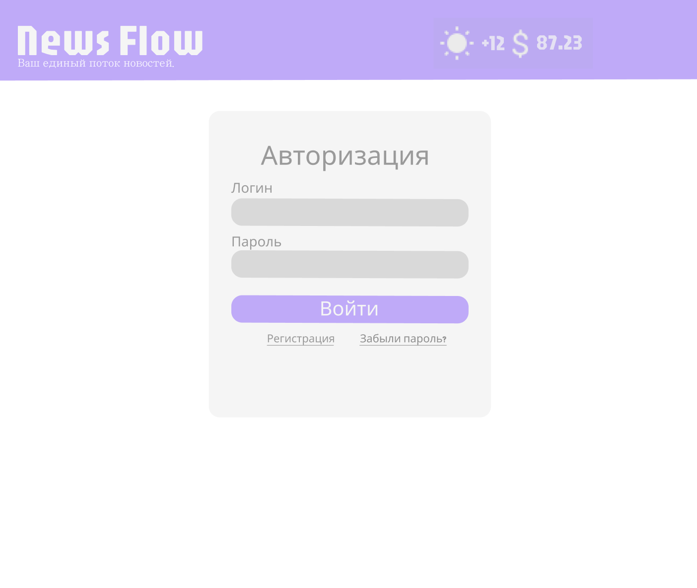
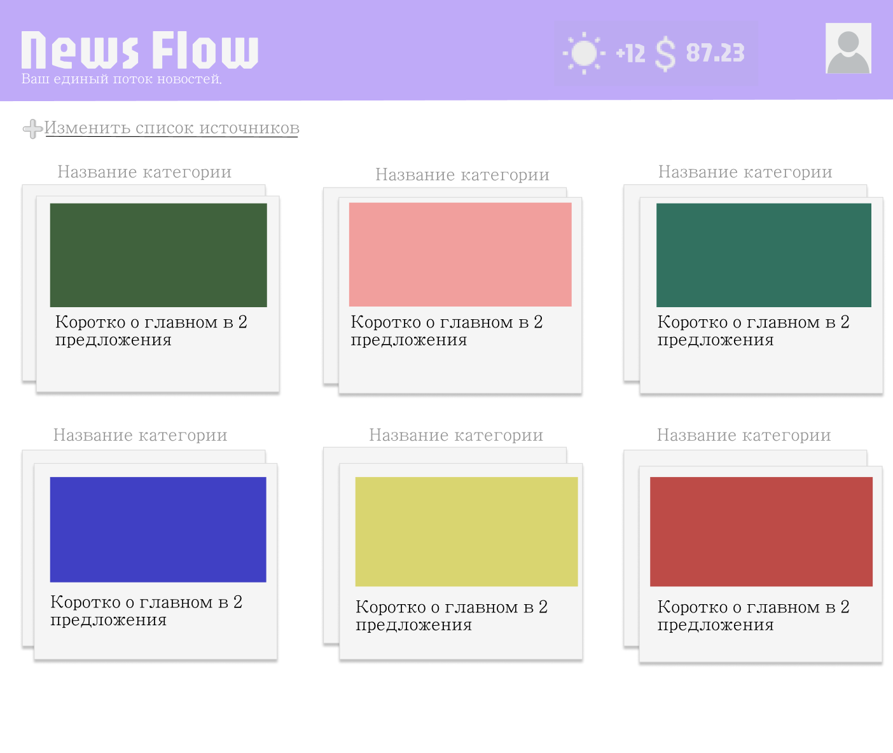
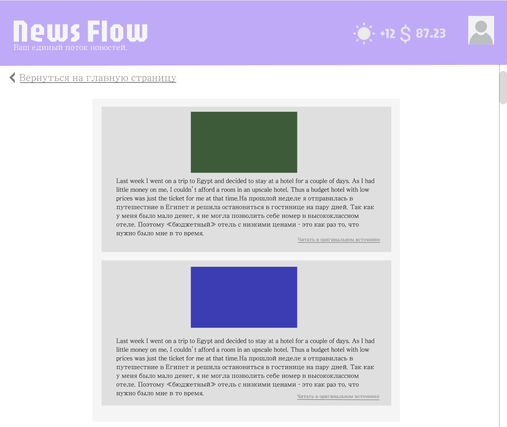
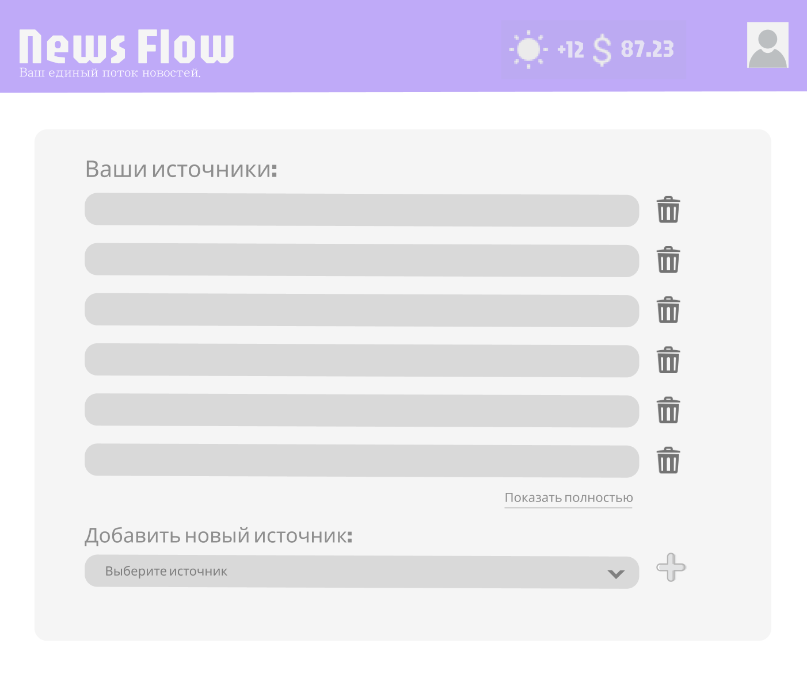

## Агрегатор новостного контента пользователя

---

курсовая работа по предмету Информационные Системы 😊

##  Software Requirements Specification

##  1. Introduction (Введение)

### 1.1 Purpose

Данный документ является спецификацией к разработке продукта "Агрегатор новостного контента пользователя". Содержит функциональные и нефункциональные требования, накладывающие определенные ограничения на разработку.

### 1.2 Scope (Область применения)

Агрегатор новостного контента пользователя - интернет-ресурс, позволяющий организовать и агрегировать поток новостей, отслеживаемый пользователем в одном месте.

Далее в документе название может быть сокращено до "Агрегатор".

* Целевая аудитория: Продукт предназначен для лиц, заинтересованных в обстановке в мире, отслеживающих множество новостных ресурсов;

* Основные функции ресурса:
    * Агрегирование пользовательского контента по категориям (например, новости IT, спорта, фондового рынке) в одном месте;
    * Автоматический мониторинг источников и актуальное обновление главной страницы с новостями;

* Границы системы:
    * Пользователи могут пополнять список отслеживаемых ресурсов из списка предлагаемых "Агрегатором";
    * Пользователи могут удалять ресурсы из списка отслеживаемых;
    * Пользователи могут просматривать сводки новостей на главной странице и при нажатии на определенную новость изучать полное содержимое;
    * Пользователи могут переходить на оригинальный источник новости;
    * Пользователи не могут добавлять собственные источники новостей;
    * Пользователь не может просматривать и редактировать страницу новостей другого пользователя.

##  2. Functionality (Функциональные требования)

###  2.1 Авторизация

F2.1.1 Система должна предоставлять пользователю возможность зарегистрироваться с помощью уникального логина, адреса электронной почты и пароля;

F2.1.2 Система должна предоставлять пользователю возможность войти в уже существующий аккаунт при помощи логина и пароля;

F2.1.3 Система должна предоставлять пользователю возможность восстановить пароль с помощью отправки проверочного кода на почту;

F2.1.4 Система должна отслеживать время "жизни" проверочного кода, отправляемого на почту и в случае попытки ввести уже просроченный код выдавать ошибку.

###  2.2. Изменение списка отслеживаемых источников

F2.2.1. Система должна предоставлять пользователю возможность просмотра доступных для отслеживания источников;

F2.2.2 Система должна предоставлять пользователю возможность добавления источника в список отслеживаемых;

F2.2.3 Система должна предоставлять пользователю возможность удалять источник из списка отслеживаемых;

F2.2.4 Система должна предоставлять возможность добавления шаблона - набор новостных источников в одной тематике (финансы, спорт, IT и тд).

###  2.3 Главная страница - агрегация по категориям

F2.3.1 Система должна самостоятельно классифицировать новости по категориям;

F2.3.2 Система должна агрегировать новости одной тематики в группу и отображать их в виде стопки бумаг, где последняя бумага - последняя новость в данной группе;

F2.3.3 Система должна предоставлять пользователю возможность при нажатии на категорию просматривать все новости, содержащиеся в ней;

F2.3.4 Система должна автоматически мониторить публикацию актуальных новостей отслеживаемых источников и обновлять главную страницу.

##  3. Usability (Требования к удобству использования)

U3.1 Система должна удовлетворять [10 эвристикам Нильсона](https://www.nngroup.com/articles/ten-usability-heuristics/);

U3.2 Основные функции системы должны быть доступны в не более чем 2 клика;

U3.3 Система должна предоставлять поддерживать различные темы интерфейса: светлую и темную

###  3.2 Прецеденты использования

#### 3.2.1 Прецедент: добавление источника новостей

| Параметр | Значение |
| :---- | :---- |
| **ID** | 1 |
| **краткое описание** | авторизованный пользователь добавляет новостной ресурс в список отслеживаемых |
| **главный актер** | авторизованный пользователь |
| **предусловия** | пользователь авторизован в системе пользователь находится на главной странице приложения |
| **основной поток** | пользователь нажимает на кнопку "изменить список источников" пользователь видит список доступных для отслеживания источников пользователь выбирает один из них и нажимает на него  |
| **альтернативный поток** | если соединение разорвано - система пытается восстановить его если источник перестал быть возможным к отслеживанию, он больше не отображается в списке |
| **постусловия** | добавленный источник отслеживается системой и его актуальные новости добавляются в пользовательские категории |

####  3.2.2 Прецедент: просмотр всех новостей одной тематики

| Параметр | Значение |
| :---- | :---- |
| **ID** | 2 |
| **краткое описание** | авторизованный пользователь просматривает все новости в одной группе (теме) |
| **главный актер** | авторизованный пользователь |
| **предусловия** | пользователь авторизован в системе пользователь находится на главной странице приложения пользователь уже имеет список отслеживаемых источников новости отображаются по группам в виде стопок бумаг на главной странице приложения |
| **основной поток** | пользователь нажимает на группу новостей  все новости в данной группе отображаются в виде вертикальной ленты скроллинга пользователь просматривает их и при необходимости переходит на оригинальный сайт новости  |
| **альтернативный поток** | если соединение разорвано - система пытается восстановить его если появилась новая новость в данной категории, она отображается в потоке |
| **постусловия** | пользователь в случае перехода на оригинальный источник изучает новость на внешнем сайте |

####  3.2.3 Прецедент: восстановление забытого пароля пользователя

| Параметр | Значение |
| :---- | :---- |
| **ID** | 3 |
| **краткое описание** | пользователь, имеющий аккаунт в системе при авторизации забывает пароль и нажимает на кнопку "Забыли пароль?" и система отправляет проверочный код на почту |
| **главный актер** | пользователь, имеющий аккаунт в системе |
| **предусловия** | пользователь ранее заводил аккаунт в системе, указав свою почту, логин и пароль в окне регистрации на данный момент он забыл свой пароль( пользователь находится на окне авторизации |
| **основной поток** | пользователь нажимает на кнопку "Забыли пароль?" система отправляет проверочный код (с фиксированным временем жизни) на почту, указанную в аккаунте пользователя и уведомляет пользователя, что проверочный код отправлен пользователю приходит проверочный код на почту он вводит его в окно ввода проверочного кода код корректен и система предлагает пользователю сменить пароль пользователь вводит новый пароль и авторизуется |
| **альтернативный поток** | если пользователь не имеет доступ к указанной в аккаунте почте, он не сможет восстановить доступ к аккаунту если пользователь пытается ввести простроченный код, система его не принимает |
| **постусловия** | пользователь авторизован в системе и находится на главной странице приложения |

###  3.3 Design Constraints (Ограничения разработки)

3.3.1 В качестве архитектуры системы выбрать микросервисную;

3.3.2 Для разработки бэкенда использовать язык программирования Kotlin и фреймворк Spring Boot с необходимыми модулями;

3.3.3 В качестве брокера сообщений (для обмена сообщениями основной сервис и сервис отправки емейлов) использовать Kafka;

3.3.4 В качестве системы сборки использовать Gradle;

3.3.5 Разработку вести по методологии Agile;

3.3.6 Для разработки фронтенда использовать язык программирования JavaScript с библиотекой React.js;

3.3.7 Для взаимодействия фронтэнда и бэкенда использовать протокол HTTP, спецификацию REST;

3.3.8 Для хранения данных использовать базу данных PostgreSQL.

 3.3.9 Планируемая архитектура приложения:

####  3.4 User Interfaces (Пользовательские интерфейсы)

*Основная палитра:*

* C3A9FD *
* D9D9D9 *
* F5F5F5 *

*Основной шрифт:*

*  Jaro
*  JejuMyeongjo

###  3.5 Software Interfaces (Программные интерфейсы)

3.5.1 API для интеграции с почтой:

* Встроенная интеграция Spring с javax.mail API - JavaMailSender

3.5.2 API для оперативной информации:

* Яндекс.Погода API: [https://yandex.ru/dev/weather/](https://yandex.ru/dev/weather/),
* API курсов валют ЦБ РФ: [https://www.cbr.ru/development/SXML](https://www.cbr.ru/development/SXML/)

###  3.6 Licensing Requirements (Требования к лицензированию)

3.6.1 Лицензия на контент

* Контент сайта защищён авторскими правами, использование контента возможно только с разрешения правообладателя.

3.6.2 Лицензия на сторонние библиотеки или API

* Сайт обязуется соблюдать лицензионные условия сторонних сервисов.

3.6.3 Лицензия на медиа

* Сайт обязуется иметь и соблюдать лицензионное соглашение на не принадлежащие ему медиа, используемые на сайте.