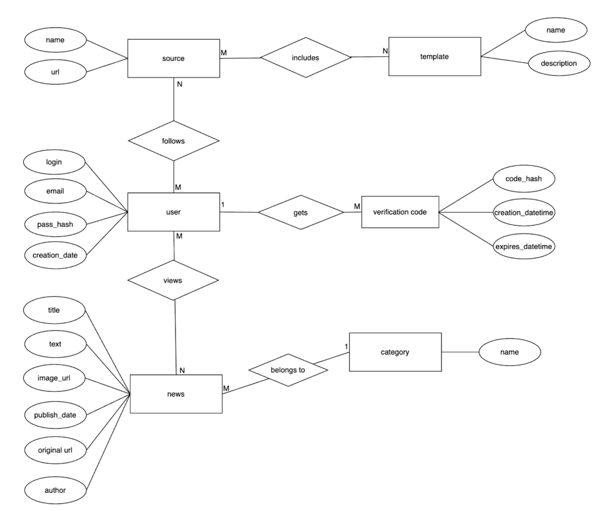

**Федеральное государственное автономное образовательное учреждение высшего образования «Национальный исследовательский университет ИТМО»** 

**Факультет программной инженерии и компьютерной техники** 

**Дисциплина: Информационные системы**

**Курсовая работа №1**

“Агрегатор новостного контента пользователя”

**Этап 2**  
**Проектирование базы данных**


[PL/PSQL процедуры для выполнения критически важных запросов	9](#pl/psql-процедуры-для-выполнения-критически-важных-запросов)

## <span style="color:#C3A9FD">ER-модель базы данных</span> {#er-модель-базы-данных}



## <span style="color:#C3A9FD">Даталогическая модель базы данных</span> {#даталогическая-модель-базы-данных}

![][image2]

# <span style="color:#C3A9FD">SQL скрипты</span>

## <span style="color:#C3A9FD">Создание БД и таблиц</span> {#создание-бд-и-таблиц}

```sql
SELECT 'CREATE DATABASE news_aggregator' WHERE NOT EXISTS (
    SELECT FROM pg_database WHERE datname = 'news_aggregator'
)

-- Установить контекст для созданной БД
\c news_aggregator

CREATE TABLE categories (
    category_id SERIAL PRIMARY KEY,
    name VARCHAR(100) NOT NULL UNIQUE,
    description TEXT
);

CREATE TABLE users (
    user_id SERIAL PRIMARY KEY,
    login VARCHAR(50) NOT NULL UNIQUE,
    email VARCHAR(100) NOT NULL UNIQUE CHECK (
        email ~* '^[A-Za-z0-9._%+-]+@[A-Za-z0-9.-]+\.[A-Za-z]{2,4}$'
    ),
    password_hash CHAR(60) NOT NULL, -- Хэш пароля
    created_date TIMESTAMP WITHOUT TIME ZONE NOT NULL DEFAULT CURRENT_TIMESTAMP
);

CREATE TABLE verification_codes (
    code_id SERIAL PRIMARY KEY,
    user_id INTEGER NOT NULL REFERENCES users(user_id) ON DELETE CASCADE,
    code_hash VARCHAR(255) NOT NULL,
    expires_time TIMESTAMP WITHOUT TIME ZONE NOT NULL,
    -- Ограничение: один активный код на пользователя
    UNIQUE (user_id)
);

CREATE TABLE sources (
    source_id SERIAL PRIMARY KEY,
    name VARCHAR(255) NOT NULL UNIQUE,
    url VARCHAR(500) NOT NULL UNIQUE
);

CREATE TABLE source_categories (
    source_id INTEGER NOT NULL REFERENCES sources(source_id) ON DELETE CASCADE,
    category_id INTEGER NOT NULL REFERENCES categories(category_id) ON DELETE CASCADE,
    PRIMARY KEY (source_id, category_id)
);

CREATE TABLE templates (
    template_id SERIAL PRIMARY KEY,
    name VARCHAR(100) NOT NULL UNIQUE,
    description TEXT,
    category_id INTEGER REFERENCES categories(category_id) ON DELETE SET NULL
);

CREATE TABLE template_sources (
    template_id INTEGER NOT NULL REFERENCES templates(template_id) ON DELETE CASCADE,
    source_id INTEGER NOT NULL REFERENCES sources(source_id) ON DELETE CASCADE,
    PRIMARY KEY (template_id, source_id)
);

CREATE TABLE user_templates (
    user_id INTEGER NOT NULL REFERENCES users(user_id) ON DELETE CASCADE,
    template_id INTEGER NOT NULL REFERENCES templates(template_id) ON DELETE CASCADE,
    PRIMARY KEY (user_id, template_id)
);

CREATE TABLE user_sources (
    user_id INTEGER NOT NULL REFERENCES users(user_id) ON DELETE CASCADE,
    source_id INTEGER NOT NULL REFERENCES sources(source_id) ON DELETE CASCADE,
    PRIMARY KEY (user_id, source_id)
);

CREATE TABLE news (
    news_id SERIAL PRIMARY KEY,
    title VARCHAR(500) NOT NULL,
    content TEXT NOT NULL,
    url VARCHAR(500) UNIQUE NOT NULL, -- Ссылка на оригинал
    image_url VARCHAR(500),
    published_date TIMESTAMP WITHOUT TIME ZONE NOT NULL,
    source_id INTEGER NOT NULL REFERENCES sources(source_id) ON DELETE RESTRICT,
    category_id INTEGER NOT NULL REFERENCES categories(category_id) ON DELETE RESTRICT
);

CREATE TABLE user_news (
    user_id INTEGER NOT NULL REFERENCES users(user_id) ON DELETE CASCADE,
    news_id INTEGER NOT NULL REFERENCES news(news_id) ON DELETE CASCADE,
    is_read BOOLEAN NOT NULL DEFAULT FALSE,
    PRIMARY KEY (user_id, news_id)
);
```

